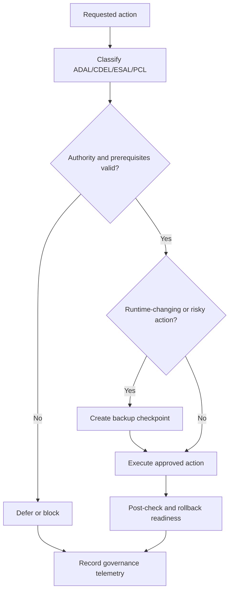

# Yellow-Control

Yellow-Control is a Hermes-compatible governance layer that helps teams run persistent autonomous agents with enforceable policy gates, classification controls, and checkpoint-first runtime safety.

## Status

v0.1.1 early operational release

## What problem Yellow-Control solves

Persistent agents can execute high-impact actions quickly, but governance can become inconsistent across teams and runtime environments. Yellow-Control provides a reusable control layer that standardizes decision gates, action classification, backup and rollback discipline, and governance telemetry so operators can make traceable, safer execution decisions.

## Intended audience

- System administrators
- Cyber-security administrators
- DevSecOps and platform teams
- Agent-runtime maintainers

This repository is not for casual toy-agent experimentation.

## At a glance

| Component | Path | Purpose |
|---|---|---|
| Governance skill | `skills/yellow-control-governance/` | Hermes-compatible skill for policy-gated operation |
| Governance model | `docs/governance-model.md` | Operating model and role boundaries |
| Policy gates | `docs/policy-gates.md` | Allow/defer/block decision gates |
| Backup and rollback | `docs/backup-and-rollback.md` | Checkpoint-first controls before risky changes |
| Governance telemetry | `docs/governance-telemetry.md` | Decision and evidence reporting model |
| External-service governance | `docs/external-service-governance.md` | Controls for external access and authority |
| Runtime classification | `docs/runtime-classification.md` | ADAL/CDEL/ESAL/PCL classification model |
| Safe examples | `examples/` | Dry-run-first, non-production templates |

## Prerequisites

- Working Hermes Agent installation
- Git installed
- GitHub access for clone/fork/contribution
- Hermes skills support enabled
- Normal Hermes bundled skills available
- Safe workspace for testing

## Hermes / Nous Research alignment

- Yellow-Control is Hermes-compatible.
- Yellow-Control follows a skill-first structure.
- `skills/yellow-control-governance/SKILL.md` is the primary entry point.
- Progressive disclosure is used through `skills/yellow-control-governance/references/`.
- Yellow-Control is not an official Hermes or Nous Research endorsement unless explicitly accepted by maintainers.

## How to use with Hermes

1. Clone this repository:

   `git clone https://github.com/Eurobotics-Association/yellow-control.git`

2. Primary skill path:

   `skills/yellow-control-governance/SKILL.md`

3. For skill installation/tap/loading steps, follow the current Hermes skills documentation for your installed Hermes version.

4. Safe validation prompt:

   "Classify this requested action with ADAL/CDEL/ESAL/PCL, run policy gates, and return allow/defer/block with rationale and required follow-up."

## Governance flow

## Repository map

- `AGENTS.md` repository operation constraints
- `CONTRIBUTING.md` contribution process and standards
- `docs/governance-model.md` governance operating model
- `docs/policy-gates.md` policy gate logic and outcomes
- `docs/backup-and-rollback.md` backup and rollback controls
- `docs/governance-telemetry.md` governance evidence and reporting
- `docs/external-service-governance.md` external service authority rules
- `docs/runtime-classification.md` ADAL/CDEL/ESAL/PCL reference
- `skills/yellow-control-governance/SKILL.md` primary Hermes-compatible skill
- `skills/yellow-control-governance/references/` detailed control references
- `examples/hermes/` dry-run-first example maintenance wrapper and systemd units
- `examples/notifications/` governance report notification template

## Fast links to governance topics

- ADAL/CDEL/ESAL/PCL classification: [docs/runtime-classification.md](docs/runtime-classification.md)
- Policy gates and decision logic: [docs/policy-gates.md](docs/policy-gates.md)
- Backup and rollback controls: [docs/backup-and-rollback.md](docs/backup-and-rollback.md)
- Telemetry and decision evidence: [docs/governance-telemetry.md](docs/governance-telemetry.md)
- External-service governance: [docs/external-service-governance.md](docs/external-service-governance.md)
- Core governance model: [docs/governance-model.md](docs/governance-model.md)
- Skill-level references:
  - [skills/yellow-control-governance/references/adal-esal-pcl.md](skills/yellow-control-governance/references/adal-esal-pcl.md)
  - [skills/yellow-control-governance/references/policy-gates.md](skills/yellow-control-governance/references/policy-gates.md)
  - [skills/yellow-control-governance/references/backup-and-rollback.md](skills/yellow-control-governance/references/backup-and-rollback.md)
  - [skills/yellow-control-governance/references/governance-telemetry.md](skills/yellow-control-governance/references/governance-telemetry.md)

## Related repository pattern

- Public governance layer repository: `yellow-control` (this repo)
- Future/sample external systems management repository: `yellow-external-systems-management` (pattern reference)
- Future/sample backup runtime repository: `backup-hermes` (pattern reference)
- Private runtime repositories for real infrastructure data: private by design and not included here

## Help wanted

Contributions and review are welcome, especially for:

- policy-gate test fixtures and edge-case coverage
- operator readability improvements in docs and references
- additional dry-run-first examples for safe rollout
- compatibility validation across Hermes runtime versions

Please use `CONTRIBUTING.md`, `SECURITY.md`, and the issue/PR templates when contributing.

## Community contact

If you are a system administrator, cyber-security administrator, DevSecOps/platform team member, Hermes user, or agent-runtime maintainer, your review and proposals are welcome.

Use GitHub Issues in this repository for bug reports, governance proposals, and skill-compatibility reports. Use pull requests for concrete patches and discussions tied to code/docs changes.

Repository contact point: GitHub repository issues and pull requests.

## Authorship and AI assistance

Author: F.M. Robert Vergnes / robert.vergnes@yahoo.fr
Assisted-by: ChatGPT: GPT-5.5 Thinking; Codex
