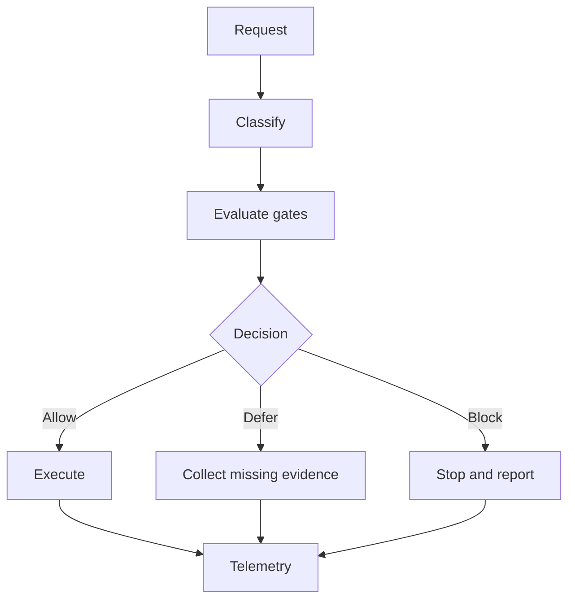

# Yellow-Control

Yellow-Control is a public-safe governance layer for persistent autonomous agents, extracted from operational governance sources and redacted for public publication.

Status: v0.1.2 source-preserving public extraction (review branch)

## Who this repository is for

- System administrators
- Cyber-security administrators
- DevSecOps and platform teams
- Agent-runtime maintainers
- Hermes users operating persistent autonomous agents

This repository is not for casual toy-agent experimentation.

## Problem this repository solves

Persistent agents can execute privileged and external actions rapidly. Yellow-Control keeps governance enforceable: classify actions, evaluate gates, and produce traceable allow/defer/block decisions.

## Prerequisites

- Hermes Agent already installed
- Git installed
- GitHub access for clone/fork/contribution
- Hermes skills support enabled
- Standard Hermes bundled skills available
- Safe workspace for testing

## Hermes / Nous Research alignment

- Hermes-compatible governance skill structure
- Skill-first layout
- SKILL.md as primary entry point
- Progressive disclosure via references and canonical docs
- No official Hermes/Nous endorsement claim unless accepted by maintainers

## At a glance

| Component | Purpose |
|---|---|
| docs/runtime-classification.md | ADAL/CDEL/ESAL/PCL model |
| docs/policy-gates.md | Enforceable gate system |
| docs/external-service-governance.md | External service governance |
| docs/runtime-maintenance-governance.md | Maintenance governance lifecycle |
| docs/secrets-handling.md | Secret/redaction policy |
| skills/yellow-control-governance/SKILL.md | Skill behavior contract |

## Governance flow



## Fast links

- docs/governance-model.md
- docs/runtime-classification.md
- docs/policy-gates.md
- docs/authority-model.md
- docs/external-service-governance.md
- docs/secrets-handling.md
- docs/backup-and-rollback.md
- docs/runtime-maintenance-governance.md
- docs/github-governance.md
- docs/governance-telemetry.md
- docs/external-systems-package-pattern.md
- docs/scope-boundaries.md
- docs/hermes-skill-submission-readiness.md
- skills/yellow-control-governance/references/index.md

## Related repository pattern

- yellow-control (public governance)
- future/sample external systems management repo
- future/sample backup-governance repo
- private runtime repositories for real infrastructure data (must remain private)

## How to use with Hermes

Clone:

`git clone https://github.com/Eurobotics-Association/yellow-control.git`

Primary skill path:

`skills/yellow-control-governance/SKILL.md`

Installation/tap/load should follow current Hermes documentation for your installed version.

Safe validation prompt:

"Classify this task with ADAL/CDEL/ESAL/PCL, apply policy gates, and return allow/defer/block with rationale and required evidence."

## Repository map

- docs/
- skills/
- examples/hermes/
- examples/external-systems-package/
- examples/notifications/
- .github/

## Community contact

Review, issues, proposals, and discussion are welcome from system admins, cyber-security admins, DevSecOps/platform teams, Hermes users, and runtime maintainers.

Use GitHub Issues and PRs in this repository.

## Help wanted

- policy gate clarity review
- more public-safe examples
- wording improvements for cross-team operations
- CI hardening proposals

## Authorship and AI assistance

Author: F.M. Robert Vergnes / robert.vergnes@yahoo.fr

Assisted-by: ChatGPT: GPT-5.5 Thinking; Codex


## Source-preserving extraction notes

This branch extracts and generalizes real governance material while preserving decision logic.

Where private examples existed, fictional public-safe examples are substituted.

No placeholder-only canonical docs are intentionally retained.


## Additional operational context

Author: F.M. Robert Vergnes / robert.vergnes@yahoo.fr
Assisted-by: ChatGPT: GPT-5.5 Thinking [canmore], Codex

# private-control-repo

`private-control-repo` is a lightweight governance baseline for runtime-agent running on Hermes Agent. Hermes runtime safety (checkpoints, rollback, dangerous-command approvals, and tool boundaries) is **primary**.

This repository does **not** replace the Hermes security model. It curates baseline governance documents and deployable baseline files.

Authority contact details are not stored in Git. This repository stores the policy and procedure only.

Operational trust is separate from authority proof. The `oscar` account may be a trusted operational context for running operator-owned own Hermes runtime and deploying reviewed baseline files, but it is not by itself authority to approve governance, admin, sudoers, SSH-key, or security-boundary changes. See [Authority verification policy](docs/authority-policy.md) and [Security and admin boundaries](docs/security-admin-boundaries.md).

## Positioning

- Runtime is the operational truth for runtime-agent.
- `oscar-backup` is the Oscar-owned runtime backup/rollback snapshot repository.
- `private-control-repo` is a temporary Oscar-specific control/skill staging repository.
- `private-control-repo` is not the runtime backup repository.
- `private-control-repo` is not the long-term Yellow Suite development repository.
- Git here is curated baseline/staging history only (not runtime state history).
- Runtime state is **not** auto-pushed to Git.
- Runtime namespace split: `<runtime-register-root>` (deployed governance docs/config), `<runtime-register-root>` (runtime skills), and `<runtime-state-root>/` (mutable evidence/backups/audits).
- Oscar proposes changes by PR; it does not unilaterally overwrite baseline governance.
- Runtime `<runtime-register-root>` is not edited directly as source-of-truth; SOUL changes are proposed in Git by PR.

## Operating model

```mermaid
flowchart TD
    A[Robert / Admin Authority] --> B[upstream private-control-repo baseline]
    B --> C[Oscar fork + PR path]
    C --> B
    B --> D[deploy.sh YELLOW baseline deploy]
    D --> E[<runtime-register-root>
    E --> F[Hermes checkpoints + rollback + approvals<br/>primary runtime safety]
```

- **Hermes checkpoints -> runtime rollback**
- **Git -> baseline evolution**
- **Admin (Robert) -> approval authority**
- **Oscar -> proposer + executor, not owner**


## Before applying the baseline

Do not deploy the baseline before GitHub, Telegram, email, fallback provider, and basic browser/API channels are validated. See [runtime-agent first-pass bootstrap checklist](docs/first-pass-bootstrap.md).

Manual sudo prerequisite details are documented in the first-pass bootstrap guide: [runtime-agent first-pass bootstrap checklist](docs/first-pass-bootstrap.md).

Run the pre-deploy bootstrap check first:

```bash
./scripts/fp-bootstrap.sh --check
./scripts/deploy.sh runtime-governance --dry-run
./scripts/deploy.sh skills --dry-run
```

If bootstrap reports WARN/FAIL, run `./scripts/fp-bootstrap.sh --recommend` and follow the printed next actions.

`deploy.sh` refuses baseline deployment until bootstrap readiness is confirmed by marker file (`<runtime-register-root>`) or explicitly overridden with `--skip-bootstrap-check`.

Weekly Hermes update checking is recommended. Unattended auto-update remains deferred until explicitly approved and tested.

## First project: runtime-agent First-Pass Bootstrap

Before deploying runtime governance scopes, run the bootstrap project first.

- Use [`prompts/bootstrap-project.md`](prompts/bootstrap-project.md) as the first Hermes task.
- Complete the staged bootstrap model before control-plane baseline deployment.
- `deploy.sh` should only be used after bootstrap project closure.

References:
- [runtime-agent First-Pass Bootstrap Project](docs/bootstrap-project.md)
- [runtime-agent first-pass bootstrap checklist](docs/first-pass-bootstrap.md)
- [Bootstrap project prompt](prompts/bootstrap-project.md)


## Deploy script boundaries (documentation)

- `scripts/deploy.sh` is a **YELLOW** script for normal baseline deployment.
- Run as `oscar` user by default.
- Do **not** run as `root` except explicit test/admin exception with `--allow-root`.
- **RED** scripts are privileged/admin-impacting and are **not implemented yet** in this repository.

## Governance and safety docs

- [Governance levels reference (ADAL/CDEL/ESAL/PCL)](docs/security/governance-levels-reference.md)
- [Agent PAM/IAM policy (ADAL/CDEL/ESAL/PCL)](docs/security/agent-pam-iam-adal-cdel-policy.md)
- [External access register](docs/security/external-access-register.md)
- [Remote server baseline audit policy](docs/security/remote-server-baseline-audit.md)
- External Packages Management architecture boundary is defined in the security governance docs and External Access Register guidance.
- [Yellow skills model](docs/skills/yellow-skills.md)
- [Yellow skill development workflow](docs/skills/yellow-skill-development-workflow.md)
- [Yellow skill test protocol](docs/skills/yellow-skill-test-protocol.md)
- [Skill register](docs/skills/skill-register.md)
- [Security and admin boundaries](docs/security-admin-boundaries.md)
- [Script color policy](docs/script-color-policy.md)
- [Rollback guide](docs/rollback.md)
- [Backup and recovery](docs/backup-and-recovery.md)
- [Policy choices to review](docs/policy-choices-to-review.md)
- [Hermes weekly update policy](docs/hermes-update-policy.md)
- [Authority verification policy](docs/authority-policy.md)
- [Authority contacts procedure](docs/authority-contacts-procedure.md)
- [Authority registry example template](templates/authority-registry.example.json)
- [Authority check prompt](prompts/authority-check.md)

## What is versioned here

- Governance and operating policies (`policy/`)
- Security/admin boundary documentation (`docs/`)
- Global baseline SOUL source (`profiles/global/SOUL.md`)
- Reusable governance prompts (`prompts/`)
- Deployment and drift-check scripts (`scripts/`)

## Deployment model

Deployments are explicit and scoped from repository baseline into `${HERMES_HOME:-$HOME/.hermes}`.

Supported scopes:
- `runtime-governance`: SOUL/AGENTS/README + governed config/docs references under `<runtime-register-root>`
- `skills`: deploys proposed Yellow skills into standard Hermes layout:
  - `<runtime-register-root>`
  - `<runtime-register-root>`
  - `<runtime-register-root>`
- `all`: includes both scopes above
- Legacy compatibility scopes remain available: `soul`, `policy`, `prompts`

Deploy workflow modes:
- `--prepare-merge` (default): normal/safe mode for mature/non-newborn runtimes; controlled analysis/staging with backups, and sensitive differing files are **staged**, not overwritten.
- `--apply-staged`: exceptional mode, not routine; applies eligible direct copies/replacements with backups only after reviewed staged candidates and explicit Robert approval.
- `--dry-run`: simulation only.

Important boundaries:
- Deploy is **not** an intelligent automatic semantic merge.
- Sensitive runtime governance files are never blindly overwritten when different.
- For `SOUL.md`, `AGENTS.md`, and `SKILL.md`, prefer targeted manual apply of reviewed merged proposals over generic `--apply-staged`.
- Semantic merge decisions require Oscar/Codex review and Robert approval.
- Existing runtime skills are preserved; no wholesale overwrite and no delete behavior for `<runtime-register-root>`.

`docs/` and `templates/` remain governance/reference materials and are not runtime-deployed unless explicitly included by scope.
## Never commit

- `.env`, `auth.json`, tokens, sessions, secrets
- Provider credentials or wallet keys
- Live runtime logs/caches
