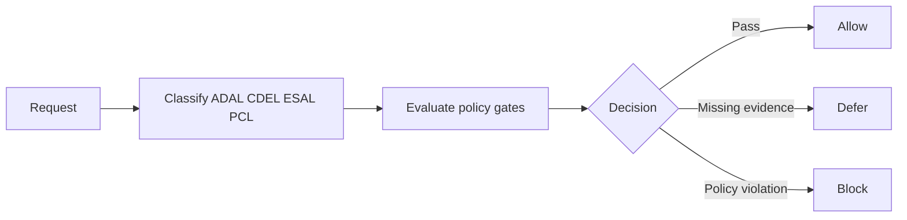

# Yellow-Control

Author: F.M. Robert Vergnes / robert.vergnes@yahoo.fr
Assisted-by: ChatGPT: GPT-5.5 Thinking; Codex

Yellow-Control is a public-safe, Hermes-compatible governance layer for classifying and gating persistent autonomous-agent actions.

## Status

| Item | Status |
| --- | --- |
| Version | v0.1.3 |
| Scope | Narrow Yellow-Control governance skill and human-facing documentation |
| Hermes compatibility | Compatible skill layout; not officially endorsed by Hermes or Nous Research unless accepted by them |
| Runtime state | Private, operator-managed, and outside this public repository |

## What this is

Yellow-Control defines reusable governance doctrine for agents that may change systems, use external services, handle confidential material, or operate persistently. It provides classification rules, policy gates, backup and rollback expectations, external-access governance, secrets-handling rules, repository workflow guidance, and telemetry expectations.

The canonical classifications are:

| Acronym | Expansion | Use |
| --- | --- | --- |
| ADAL | Agent Delegated Administration Level | Host, identity, administrative, and system-impact authority. |
| CDEL | Container Delegated Execution Level | Containers, runners, sandboxes, sockets, and delegated execution. |
| ESAL | External Service Authority Level | APIs, SaaS, repositories, dashboards, servers, accounts, and webhooks. |
| PCL | Project Confidentiality Level | Information read, written, logged, transmitted, or published. |

## What this is not

Yellow-Control is not a runtime installer, package manager, secret store, project-management framework, skill registry, incident archive, or operational register repository. It does not contain private hosts, private paths, credentials, logs, real register entries, or Oscar-specific runtime material.

## Who this is for

Yellow-Control is for maintainers and operators who want a public, installable governance skill for persistent autonomous agents while keeping live operational state private. It is also useful for reviewers who need readable policy mirrors under `docs/`.

## How it works

1. Classify the requested action with ADAL, CDEL, ESAL, and PCL.
2. Check authority, scope, confidentiality, backup, rollback, external-access, persistence, repository, and telemetry gates.
3. Allow only when required evidence and approvals are present.
4. Defer when evidence is incomplete.
5. Block when a request violates policy, exposes private state, self-grants authority, or bypasses governance.

## Repository layout

| Path | Purpose |
| --- | --- |
| `skills/yellow-control-governance/` | Installable Hermes-compatible skill package. |
| `skills/yellow-control-governance/SKILL.md` | Skill entry point and Hermes metadata. |
| `skills/yellow-control-governance/references/` | Packaged operational doctrine used by the installed skill. |
| `skills/yellow-control-governance/templates/` | Public-safe YAML templates and schema starters for private runtime records. |
| `skills/yellow-control-governance/references/hermes-backup-snapshot-policy.md` | Packaged governance for native Hermes backup and snapshot readiness. |
| `docs/` | Human-facing mirrors and explanations for repository readers and maintainers. |
| `CONTRIBUTING.md` | Contribution expectations. |
| `SECURITY.md` | Public-safe security reporting guidance. |
| `CHANGELOG.md` | Version history. |

## Installable Hermes skill

`skills/yellow-control-governance/` is the installable skill package. Copy or install that directory into a Hermes-compatible skills location according to the runtime's skill-install workflow.

`skills/yellow-control-governance/references/` contains the packaged operational doctrine so the skill remains self-contained after installation. The top-level `docs/` directory mirrors relevant explanations for humans, but installed skill behavior must rely on the skill-local references.

Yellow-Control uses Hermes-compatible skill metadata and non-secret `metadata.hermes.config` settings for runtime register locations. It does not declare required environment variables and does not require secrets to install.

## Runtime registers and templates

The public skill contains templates and schema only. Live runtime registers and decision records must remain private and outside the public skill package and public repository. Runtime register paths are configurable.

| Template | Private runtime target |
| --- | --- |
| `skills/yellow-control-governance/templates/external-access-register.template.yaml` | External-access register at `yellow_control.external_access_register_path`. |
| `skills/yellow-control-governance/templates/governance-decision-record.template.yaml` | Decision records under `yellow_control.governance_decision_log_dir`. |
| `skills/yellow-control-governance/templates/server-first-contact-record.template.yaml` | Server-first-contact records under `yellow_control.server_first_contact_dir`. |

Default private runtime locations are configurable through Hermes skill config:

| Config key | Default |
| --- | --- |
| `yellow_control.external_access_register_path` | `~/.hermes/yellow-control/registers/external-access-register.yaml` |
| `yellow_control.governance_decision_log_dir` | `~/.hermes/yellow-control/decision-records` |
| `yellow_control.server_first_contact_dir` | `~/.hermes/yellow-control/server-first-contact` |

Do not commit live register files, decision records, first-contact records, private evidence, or local runtime paths to the public repository.

## Prerequisites

| Requirement | Notes |
| --- | --- |
| Hermes-compatible runtime | Must already be installed and operating. Yellow-Control does not install Hermes. |
| Git | Required for repository workflows. |
| GitHub, GitLab, or similar | Required only when repository automation is used. |
| Dedicated agent account or fork | Recommended for repository automation instead of borrowing a human maintainer session. |
| Backup/checkpoint capability | Required before risky privileged, external, persistent, or runtime-governance actions. |
| Optional integrations | Telegram, OpenWebUI, gateway, and dashboard integrations are optional runtime integrations, not Yellow-Control requirements. |
| Optional package layer | External package management is a separate optional implementation layer for target-specific server packages. |

## Native Hermes backup governance

Yellow-Control does not implement or wrap Hermes backup. Local rollback/checkpoint hygiene uses native `hermes checkpoints` and the default governance recommendation `hermes checkpoints prune --retention-days 30 --max-size-mb 500`. Hermes runtime backup archives use native `hermes backup`, optionally `hermes backup -o <path>` or `hermes backup --quick --label <name>` when appropriate. Hermes updates use `hermes update --backup` or the native `updates.pre_update_backup: true` setting when owner policy requires full pre-update backup by default.

Checkpoint pruning is not backup archive retention. Backup repositories and artifact stores are for private backup archives, manifests, and metadata, not raw `~/.hermes/checkpoints/` shadow stores. Backup archive retention is mandatory because unbounded archive growth can fill disk or repository storage. Yellow-Control only governs whether a backup or checkpoint is required, whether native or owner-approved mechanisms exist, whether targets are private, whether archive retention is approved, and what public-safe telemetry must be recorded.

## Deploying on a real Hermes runtime

This public repository provides the installable skill package, governance doctrine, and public-safe templates.
Real runtime deployment still requires a private runtime overlay for local AGENTS/SOUL adaptation, private registers, private evidence, and owner-approved local enforcement implementation.

Use `docs/runtime-deployment-pattern.md` for the deployment phases, governance boundaries, and validation checklist.
Do not commit runtime registers, decision evidence, private paths, or other runtime-private operational material to this public repository.

## Safety model

Yellow-Control is conservative by default. Unknown authority, unknown confidentiality, missing external-access registration, missing rollback evidence, or unclear operator custody causes defer or block rather than silent execution.

Public documentation and packaged references must use fictional identifiers, role names, placeholders, and redacted examples. Credentials, tokens, private keys, private hostnames, private addresses, private runtime paths, raw logs, and real register entries must stay out of the public repository.

## Community / contributions

Contributions should patch the existing governance layer rather than redesign it. Keep documentation in English, preserve metadata lines, keep examples generic and public-safe, and maintain alignment between `docs/` and `skills/yellow-control-governance/references/`.

## Authorship and AI assistance

Yellow-Control is authored by F.M. Robert Vergnes. This repository records AI assistance from ChatGPT / Codex in the document metadata lines. Compatibility with Hermes does not imply official approval, endorsement, or acceptance by Hermes or Nous Research.
