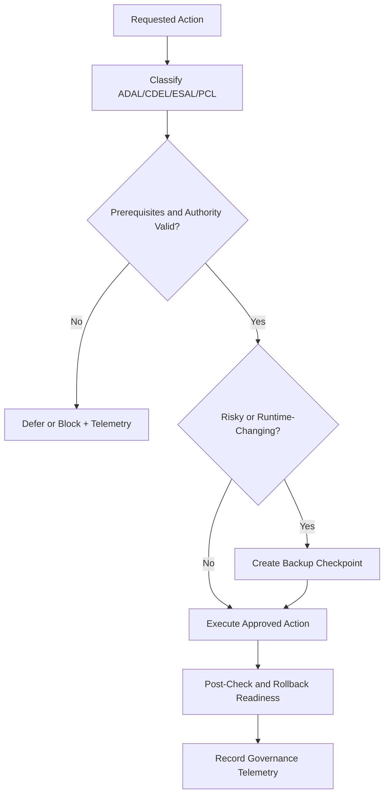

# yellow-control

Author: F.M. Robert Vergnes / robert.vergnes@yahoo.fr
Assisted-by: ChatGPT: GPT-5.5 Thinking; Codex

Yellow-control is a public-safe governance layer for persistent autonomous agents. It provides enforceable decision gates, authority and confidentiality classification, backup/rollback controls, and governance telemetry that can be integrated with Hermes-compatible agent operations.

This repository is the v0.1.0 early public release.

## At a glance

| Component | Path | Purpose |
|---|---|---|
| Governance skill | `skills/yellow-control-governance/` | Hermes-compatible control skill with runtime governance rules and references |
| Governance model | `docs/governance-model.md` | Core operating model and control boundaries |
| Policy gates | `docs/policy-gates.md` | Gate logic for allow/defer/block execution decisions |
| Backup and rollback | `docs/backup-and-rollback.md` | Checkpoint-first controls before risky runtime changes |
| Telemetry | `docs/governance-telemetry.md` | Decision/event evidence model for governance observability |
| External-service governance | `docs/external-service-governance.md` | Access and authority controls for external systems |
| Runtime classification | `docs/runtime-classification.md` | ADAL/CDEL/ESAL/PCL classification reference |
| Safe examples | `examples/` | Dry-run-first, non-production templates and wrappers |

## Scope (v0.1.0)

v0.1.0 focuses on:
- executable policy gates
- mandatory backup/rollback checkpoints before core changes
- authority classification such as ADAL/CDEL/ESAL/PCL
- governance telemetry
- external-service onboarding controls
- Hermes-compatible skill packaging

## Governance flow

## Non-goals

- This is not a full agent runtime.
- This is not a replacement for Hermes.
- This is a governance layer and skill package that can be adapted to Hermes and similar agent systems.

## Public-safe design principles

- No secrets, tokens, or private runtime state.
- No private hostnames, private IPs, or private repo paths.
- Example-only operational artifacts with dry-run-first behavior.
- Progressive disclosure: concise `SKILL.md`, details in `references/`.

## Help wanted

Contributions and review are welcome, especially for:
- strengthening policy-gate test coverage and edge-case handling
- expanding dry-run-first examples for additional deployment contexts
- improving governance telemetry schemas and auditability
- clarity edits that improve operator usability without weakening controls

Please see `CONTRIBUTING.md` before opening pull requests.
