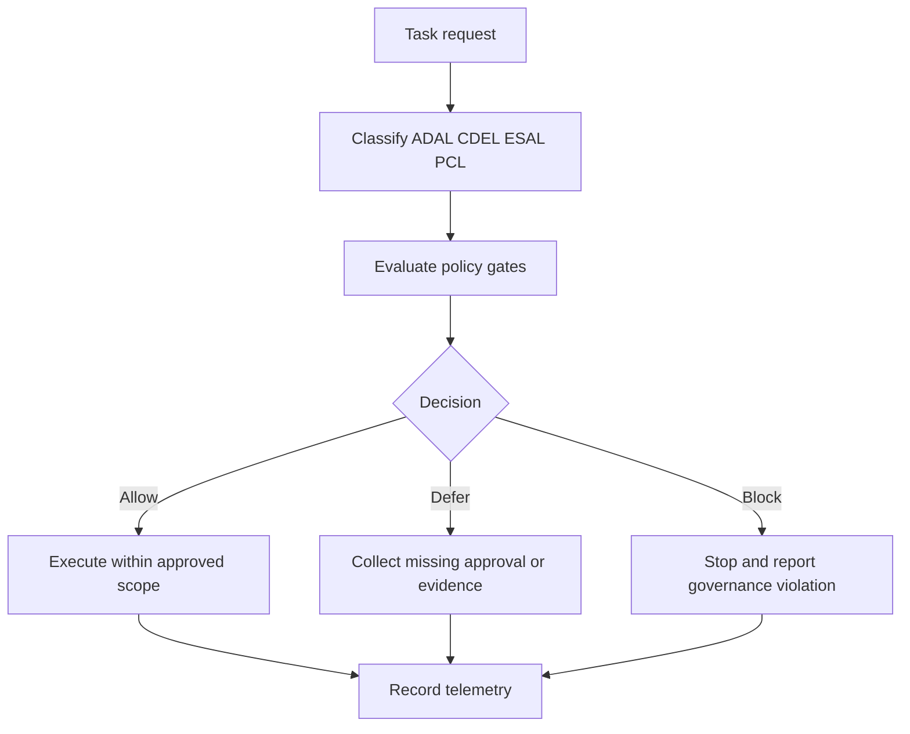

# Yellow-Control

Yellow-Control is a public-safe governance layer for persistent autonomous agents.

Status: v0.1.2 source-preserving public extraction (review branch)

## One-sentence summary

This repository preserves real governance policy logic from operational sources while redacting private runtime data and replacing private examples with fictional public-safe patterns.

## Intended audience

- System administrators
- Cyber-security administrators
- DevSecOps and platform teams
- Agent-runtime maintainers
- Hermes users operating persistent autonomous agents

This repository is not for casual toy-agent experimentation.

## Problem statement

Persistent agents can execute privileged and external actions rapidly. Teams need enforceable controls for authority, confidentiality, backup/rollback, and external access governance. Yellow-Control provides a reusable policy and skill layer for allow/defer/block decisions with traceable evidence.

## Prerequisites

- Hermes Agent already installed and functional
- Git installed
- GitHub access for clone/fork/contribution
- Hermes skills support enabled
- Normal Hermes bundled skills available
- Safe workspace for dry-run-first testing

## Hermes / Nous Research alignment

- Hermes-compatible structure
- Skill-first layout
- SKILL.md primary entry point
- Progressive disclosure through canonical docs and references
- No official Hermes/Nous endorsement claim unless accepted by maintainers

## At a glance

| Component | Purpose |
|---|---|
| docs/governance-model.md | Governance operating model and control loop |
| docs/runtime-classification.md | ADAL/CDEL/ESAL/PCL model and examples |
| docs/policy-gates.md | Enforceable gate system and decision behavior |
| docs/authority-model.md | Authority boundaries and escalation rules |
| docs/external-service-governance.md | External service register schema and onboarding rules |
| docs/secrets-handling.md | Redaction and secret-custody constraints |
| docs/backup-and-rollback.md | Backup gate and rollback expectations |
| docs/runtime-maintenance-governance.md | Update, drift, and maintenance governance |
| docs/github-governance.md | Repository and release safety governance |
| docs/governance-telemetry.md | Telemetry schema and reporting expectations |
| docs/external-systems-package-pattern.md | Public-safe package pattern for external targets |
| docs/scope-boundaries.md | Scope boundaries and private-forever constraints |
| docs/hermes-skill-submission-readiness.md | Submission-readiness checklist |
| skills/yellow-control-governance/SKILL.md | Runtime governance skill behavior contract |

## Governance flow

## Fast links to sub-documentation

- Governance model: docs/governance-model.md
- Runtime classification: docs/runtime-classification.md
- Policy gates: docs/policy-gates.md
- Authority model: docs/authority-model.md
- External service governance: docs/external-service-governance.md
- Secrets handling: docs/secrets-handling.md
- Backup and rollback: docs/backup-and-rollback.md
- Runtime maintenance governance: docs/runtime-maintenance-governance.md
- GitHub governance: docs/github-governance.md
- Governance telemetry: docs/governance-telemetry.md
- External systems package pattern: docs/external-systems-package-pattern.md
- Scope boundaries: docs/scope-boundaries.md
- Hermes skill submission readiness: docs/hermes-skill-submission-readiness.md
- Skill references index: skills/yellow-control-governance/references/index.md

## Related repository pattern

- Yellow-control public governance repository
- Future/sample external systems management repository
- Future/sample backup-governance repository
- Private runtime repositories for real infrastructure data (must remain private)

## How to use with Hermes

Clone this repository:

`git clone https://github.com/Eurobotics-Association/yellow-control.git`

Primary skill path:

`skills/yellow-control-governance/SKILL.md`

Installation/tap/load steps must follow the current Hermes documentation for your installed version.

Safe validation prompt:

"Classify this task with ADAL/CDEL/ESAL/PCL, apply policy gates, and return allow/defer/block with rationale, risk, and required evidence."

## Source-preserving extraction method

This v0.1.2 branch uses a source-preserving extraction approach:

- Mine governance content from private control-plane and runtime skill sources
- Preserve governance concepts, checklists, decision tables, and control logic
- Redact or generalize private identifiers and runtime-specific details
- Replace private examples with fictional public-safe examples
- Keep canonical policy text under docs/
- Keep skill references concise and linked to canonical docs

## Public-safe rules

- Never publish private hostnames, private IPs, credentials, tokens, or logs
- Never publish private runtime repository paths
- Never publish internal account identifiers
- Keep examples fictional by default
- Keep examples dry-run-first and non-production by default

## Repository map

- docs/
  - governance-model.md
  - runtime-classification.md
  - policy-gates.md
  - authority-model.md
  - external-service-governance.md
  - secrets-handling.md
  - backup-and-rollback.md
  - runtime-maintenance-governance.md
  - github-governance.md
  - governance-telemetry.md
  - external-systems-package-pattern.md
  - scope-boundaries.md
  - hermes-skill-submission-readiness.md
- skills/
  - yellow-control-governance/SKILL.md
  - yellow-control-governance/references/index.md
- examples/hermes/
  - policy-gated-maintenance-wrapper.sh
  - systemd/yellow-control-maintenance.service
  - systemd/yellow-control-maintenance.timer
- examples/external-systems-package/
  - governance-decision-record-sample.md
  - external-service-register-sample.md
  - server-package-sample.md
  - backup-gate-checklist.md
- examples/notifications/
  - governance-report-template.md

## What is intentionally private forever

- Live infrastructure identities and topology
- Real register entries tied to external services
- Secrets, credentials, session artifacts, and recovery material
- Internal runtime logs and mutable state paths

## Contribution expectations

- Patch, not reinvent
- Preserve governance-to-skill coherence
- Keep docs aligned with implemented examples
- Keep claims precise and scoped
- Keep changes reviewable and reversible

## Community contact

Review, issues, proposals, and discussions are welcome from system administrators, cyber-security administrators, DevSecOps/platform teams, Hermes users, and agent-runtime maintainers.

Use GitHub Issues and pull requests in this repository.

## Help wanted

- Review policy-gate decision tables for clarity and completeness
- Propose additional public-safe external-service onboarding examples
- Improve telemetry examples for multi-team operations
- Propose CI hardening that increases signal without false positives

## Versioning note

v0.1.x is an early operational series. Terminology and API surface may evolve before v1.0.

## Authorship and AI assistance

Author: F.M. Robert Vergnes / robert.vergnes@yahoo.fr

Assisted-by: ChatGPT: GPT-5.5 Thinking; Codex
