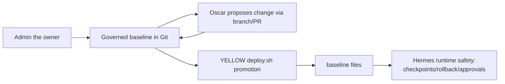

# Governance model

Enforceable decision governance for persistent autonomous agents.

## Operating model

# Operating model

## Roles

- **Human owner/admin (the owner)**: defines intent, approves sensitive actions, and accepts governance changes.
- **Oscar GitHub identity**: executes repository work (branching, patching, testing, PR drafting) within defined boundaries.
- **Hermes runtime**: runs operational behavior in `<runtime-register-root>` using governed inputs promoted from this repo.

## Baseline flow

Hermes runtime safety remains primary. Git remains curated baseline history only.

## Review-before-promotion

All durable governance changes are prepared in git, reviewed, and promoted intentionally. Runtime state does not override governance source.

## Fork/branch/PR workflow

1. Create a branch (or fork branch) for a scoped change.
2. Apply minimal patches with traceable commit history.
3. Run relevant checks.
4. Open a PR with summary, risks, and follow-ups.
5. Merge only after human review and policy compliance.

## Weekly autonomous maintenance branch policy

For guarded weekly maintenance automation:

- branch naming convention: `maintenance/hermes-weekly-YYYYMMDD-HHMM` (UTC timestamp);
- push target: Oscar fork remote (`origin` by default);
- upstream base: `upstream/main`;
- PR target: `<org>/<private-governance-repo>:main`;
- automation may open/update PR only; merge is always human-controlled.

## Runtime-first onboarding discipline

- External services and skill dependencies are onboarded in runtime first, then synchronized to repo documentation.
- Current runtime onboarding artifacts:
 - `docs/security/external-services-onboarding.md`
 - `docs/security/skill-external-dependency-register.md`
- Canonical sources remain:
 - `docs/security/external-access-register.md` for external services
 - `config/skill-register.yaml` and `docs/skills/skill-register.md` for skill entries
- GitHub role separation is mandatory in runtime guards:
 - Hermes public upstream (`<runtime-register-root>` origin) for core update checks,
 - Oscar fork for autonomous branch/push/PR work,
 - Eurobotics upstream as protected upstream repository and PR target.

## Weekly runtime scheduling model

- Weekly Hermes maintenance is scheduled with **user systemd** units, not Hermes cron.
- Rationale: Hermes should not self-manage its own runtime update/restart path from inside Hermes cron/session.
- Runtime units (deployed under `~/.config/systemd/user/`):
 - `agent-hermes-weekly-maintenance.service`
 - `agent-hermes-weekly-maintenance.timer`
- Scheduled command is guarded auto-update mode:
 - `ExecStart=/usr/local/bin/agent-hermes-weekly-maintenance --auto-update`
- Wrapper supports explicit modes:
 - `--check-only`
 - `--dry-run --auto-update`
 - `--auto-update`
- Guarded Git maintenance remains explicit/opt-in.

## Authority model

# Authority model

## Purpose

Define decision hierarchy, execution authority, and escalation rules for governed operation.

## Decision hierarchy

1. **Primary authority: the owner Vergnes**
 - Defines intent, constraints, and approval scope.
 - Has final decision authority for sensitive, irreversible, or policy-changing actions.
2. **Governance policy layer**
 - Constrains execution regardless of automation capability.
 - Overrides convenience, speed, or exploratory autonomy.
3. **Agent execution layer**
 - Performs bounded, reviewable actions within explicit approvals and policy limits.

## Human approval over autonomy

Human direction and approval take precedence over autonomous agent initiative in all cases.

## Autonomous actions allowed

- Read repository content and approved local context.
- Propose and apply reversible patches in scoped branches.
- Run bounded checks, linting, and tests.
- Draft reports, recommendations, and pull requests.

## Actions requiring explicit approval

- Any irreversible action affecting protected branches, production systems, or live assets.
- Policy-baseline changes affecting governance controls.
- Access, disclosure, or transfer of private/sensitive data.
- Spending decisions, resource-provisioning commitments, or external side effects.

## Ambiguity and escalation

- If intent, authority, or risk is ambiguous, escalate to the owner Vergnes before proceeding.
- **When in doubt, do not act irreversibly.**

## GitHub workflow authority

- Agents may open branches and pull requests within authorized repositories.
- Agents may not self-merge protected targets unless explicit approval exists and branch protections permit it.
- Merge authority for governed changes remains human-controlled by default.

## System-level authority boundaries

- Runtime execution does not grant governance override rights.
- Infrastructure or system-level operations outside approved scope require explicit human authorization.
- No component may bypass policy controls through indirect automation paths.

## Control loop

Classify -> Gate -> Decide -> Execute/Defer/Block -> Telemetry -> Review.

## Non-goals

Private runtime state and infrastructure specifics are excluded from public release.
