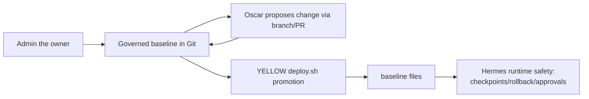

# Governance telemetry

Telemetry schema and reporting expectations.

## Telemetry model

# Operating model

## Roles

- **Human owner/admin (the owner)**: defines intent, approves sensitive actions, and accepts governance changes.
- **Oscar GitHub identity**: executes repository work (branching, patching, testing, PR drafting) within defined boundaries.
- **Hermes runtime**: runs operational behavior in `<runtime-register-root>` using governed inputs promoted from this repo.

## Baseline flow

Hermes runtime safety remains primary. Git remains curated baseline history only.

## Review-before-promotion

All durable governance changes are prepared in git, reviewed, and promoted intentionally. Runtime state does not override governance source.

## Fork/branch/PR workflow

1. Create a branch (or fork branch) for a scoped change.
2. Apply minimal patches with traceable commit history.
3. Run relevant checks.
4. Open a PR with summary, risks, and follow-ups.
5. Merge only after human review and policy compliance.

## Weekly autonomous maintenance branch policy

For guarded weekly maintenance automation:

- branch naming convention: `maintenance/hermes-weekly-YYYYMMDD-HHMM` (UTC timestamp);
- push target: Oscar fork remote (`origin` by default);
- upstream base: `upstream/main`;
- PR target: `<org>/<private-governance-repo>:main`;
- automation may open/update PR only; merge is always human-controlled.

## Runtime-first onboarding discipline

- External services and skill dependencies are onboarded in runtime first, then synchronized to repo documentation.
- Current runtime onboarding artifacts:
 - `docs/security/external-services-onboarding.md`
 - `docs/security/skill-external-dependency-register.md`
- Canonical sources remain:
 - `docs/security/external-access-register.md` for external services
 - `config/skill-register.yaml` and `docs/skills/skill-register.md` for skill entries
- GitHub role separation is mandatory in runtime guards:
 - Hermes public upstream (`<runtime-register-root>` origin) for core update checks,
 - Oscar fork for autonomous branch/push/PR work,
 - Eurobotics upstream as protected upstream repository and PR target.

## Weekly runtime scheduling model

- Weekly Hermes maintenance is scheduled with **user systemd** units, not Hermes cron.
- Rationale: Hermes should not self-manage its own runtime update/restart path from inside Hermes cron/session.
- Runtime units (deployed under `~/.config/systemd/user/`):
 - `agent-hermes-weekly-maintenance.service`
 - `agent-hermes-weekly-maintenance.timer`
- Scheduled command is guarded auto-update mode:
 - `ExecStart=/usr/local/bin/agent-hermes-weekly-maintenance --auto-update`
- Wrapper supports explicit modes:
 - `--check-only`
 - `--dry-run --auto-update`
 - `--auto-update`
- Guarded Git maintenance remains explicit/opt-in.

---
name: yellow-control-governance
description: Runtime reference for security/control-plane governance — privileged access, external access, confidentiality, recovery custody, and persistent automation guard.
version: 0.1.0
platforms: [linux]
metadata:
 hermes:
 tags: [governance, security, pam-iam, adal, cdel, esal, pcl, external-access, automation-guard, baseline-audit]
 related_skills: [yellow-project-management, yellow-skill-registry]
---

# yellow-control-governance

## Purpose

Yellow Control Governance is the runtime reference skill for security, authority, external access, confidentiality, remote baseline audit gating, and Persistent Automation Guard control.

## When to use

Use this skill before:

- sudo, package installation, Docker/container, firewall, service, or runtime changes;
- GitHub/Gmail/Telegram/API/external-service actions;
- SSH, remote host operations, dashboards, or persistent integrations;
- accessing or changing secrets, credentials, recovery settings, or account ownership;
- deployment or re-apply;
- creating/modifying/running cron jobs, skills, memory mutations, profile mutations, or other persistent automation;
- public/private/confidential disclosure decisions.

## Core concepts

- **External target** = server, VM, VPS, service, API, dashboard, account, container host, or managed runtime.
- **ADAL** = Agent Delegated Administration Level (host/server authority).
- **CDEL** = Container Delegated Execution Level (container/sandbox authority).
- **ESAL** = External Service Access Level (external service authority).
- **PCL** = Project Confidentiality Level (disclosure boundary).
- External targets are governed by the External Access Register and may reference External Packages Management context.
- **Persistent Automation Guard**: no new or modified persistent automation without register binding, documentation, and approval from the Governance Authority or an explicitly delegated Authorized Operator.
- Unknown authority defaults to no operational authority.

## Governance reference files

Reference: `references/hermes-weekly-runtime-validation-checklist.md` for non-destructive runtime validation of weekly Hermes maintenance scheduling/health.
Reference: `references/hermes-weekly-maintenance-observability-guard.md` for weekly-maintenance guard hardening (avoid `[active]` false defers), defer-evidence logging, and SUCCESS/DEFERRED/FAILED operator notification behavior.
Reference: `references/post-merge-containment-runtime-impact-review.md` for read-only containment and runtime-impact review when a merged PR payload is broader than intended hotfix scope.
Reference: `references/github-reachability-guard-diagnostics.md` for diagnosing false GitHub/network guard failures in auto-update runtime flows.
Reference: `references/runtime-external-service-onboarding.md` for runtime-first onboarding when external dependencies are present but not governance-classified.
Reference: `references/external-service-authority-chain-validation.md` for doctrine-patch validation sequence (backups, grep checks, no-secret scan, and staging-preservation reporting).
Reference: `references/runtime-wording-authority-cleanup.md` for documentation-only cleanup when legacy runtime-authority wording (e.g., loose "source-of-truth" phrasing) could mislead governance execution.
Reference: `references/external-adal25-first-connect-checklist.md` for approved ADAL-2.5 external first-connect execution order, evidence handling, and guardrails.
Reference: `references/external-onboarding-completion-verification.md` for local-only completion verification after first-connect (register entry, evidence inventory, summary artifact, backup coverage).
Reference: `references/proposal-only-pr-governance-checklist.md` for documentation-only governance PRs where execution is not approved (scope boundaries, ADAL naming separation, and validation gates).
Reference: `references/shell-redaction-integrity-check.md` for proposal shell-script integrity validation (control-character scan + syntax guards) before packaging/review handoff.
Reference: `references/proposal-package-redaction-adversarial-tests.md` for offline adversarial redaction tests, fixture handling, and no-secret scan interpretation in proposal-only script packages.
Reference: `references/proposal-shell-static-runtime-sanity.md` for offline function-definition/call-order sanity checks (catches missing helper functions that `bash -n` does not detect).
Reference: `references/publication-candidate-sanitization-checklist.md` for preparing public governance publication candidates from private runtime material (staging-only, sanitization scans, packaging evidence).
Reference: `references/public-safety-scan-self-match-guard.md` for avoiding self-referential false positives when secret-pattern scans match scanner definitions in CI/workflow files.

## Default external-service authority chain

For all external services, external servers, external packages, SaaS accounts, remote hosts, API providers, and integrations:

1. First check `agent-external-systems-management` unless the task explicitly provides another reviewed source or explicitly states no pre-registration exists.
2. Treat `agent-external-systems-management` as a human-managed preparation source, not as a runtime register.
3. Yellow-control must read and reconcile the pre-registration package with the owner's instruction; if the package conflicts with the owner's instruction, stop and report the mismatch.
4. Yellow-control writes runtime-approved entries to `<runtime-register-root>` (especially `docs/security/external-access-register.md`).
5. Oscar must not invent missing external-service metadata.
6. Oscar must not directly modify the Eurobotics upstream `agent-external-systems-management` repository; corrections must be proposed by PR through operator-owned fork/branch for the owner review.
7. Take runtime backup before and after runtime register changes.

external-target-a is one example only. This chain also applies to GitHub, Gmail/Himalaya, Telegram, OpenRouter, Browserbase, ZeroTier, OpenWebUI, local API servers, Cloudron hosts, and future external servers.

Runtime register root (runtime-agent):
- Active Yellow runtime registers live under `<runtime-register-root>`.
- Legacy `<runtime-register-root>` is historical/deployed snapshot only and must not be treated as active register root.
- Unless a task explicitly states another reviewed register root, relative register paths resolve under `<runtime-register-root>`.

- `docs/security/governance-levels-reference.md`
- `docs/security/agent-pam-iam-adal-cdel-policy.md`
- `docs/security/external-access-register.md`
- `docs/security/remote-server-baseline-audit.md`
- `docs/deployment-workflow.md`
- `AGENTS.md`

## Must do

- Consult `docs/security/governance-levels-reference.md` before applying ADAL/CDEL/ESAL/PCL in decisions.
- Consult the External Access Register before external, privileged, or security-sensitive actions.
- For private GitHub External Package repositories, verify configured authenticated access methods before declaring inaccessibility:
 - `gh auth status`
 - `gh repo view OWNER/REPO`
 - `git ls-remote git@github.com:OWNER/REPO.git HEAD`
 - `git -C <repo> ls-remote --heads origin main`
 - `git -C <repo> ls-remote --heads upstream main`
- HTTPS Git failure alone is not definitive if authenticated GH/SSH access exists.
- For runtime maintenance guards, avoid hard-coding unauthenticated HTTPS private-repo checks as a blocking network gate. Prefer remote-aware checks (`origin`/`upstream`) and classify non-critical repo reachability checks as non-blocking when the maintenance objective is Hermes core update.
- When runtime onboarding creates snapshot/supporting docs, immediately consolidate authoritative entries into canonical registers. Do not let snapshot docs become shadow authorities.
- For runtime-agent doctrine, avoid using “source of truth/source-of-truth” to imply runtime authority. Runtime state is inspected live; `runtime-backup` stores rollback snapshots; `private runtime governance repository` is temporary staging.
- Use role-safe wording for GitHub governance references: prefer “Eurobotics upstream PR target” or “protected upstream repository”; reserve “authoritative” only when explicitly describing merge authority.
- Canonical precedence for Oscar governance: external services in `docs/security/external-access-register.md`; skills in `config/skill-register.yaml` plus `docs/skills/skill-register.md`. Snapshot docs must carry explicit "supporting, not canonical" status headers.
- In governance consolidation tasks, validate both documentation integrity and runtime alignment: `git diff --check`, no-secret pattern scan on diff, and maintenance dry-run (`/usr/local/bin/agent-hermes-weekly-maintenance --dry-run --auto-update`) without executing real update.
- External Access Register entries may reference External Packages; consult the package manifest/wrappers before privileged or remote operational work when referenced.
- If target access metadata is missing/incomplete, propose a register update before operational use.
- Mark uncertain inferred metadata as `unknown` and report uncertainty explicitly.
- Do not invent missing classifications; unresolved classifications must remain `unknown`.
- If an External Package is missing/incomplete/inaccessible, report the governance gap and stop privileged or remote operational action.
- Unknown PCL defaults to `PCL-2 Private`.
- Proposal does not equal permission: proposed register, project, access, or skill changes are governance preparation only until approved by the Governance Authority or explicitly delegated Authorized Operator.
- Capability does not equal authority.
- ADAL-3T is temporary elevated delegated maintenance authority: task-scoped, time-limited, explicitly approved, logged, and revoked after expiry.
- For ADAL-3T design/proposal tasks, keep scope documentation-only unless explicit execution approval exists: no runtime/host changes, no SSH/sudo execution, no deployment/systemd edits. Require explicit "proposal only" wording in proposal artifacts and PR body.
- For ADAL-3T temporary elevation designs, enforce control-plane split: grant/revoke commands are human-admin/root only; Oscar may use read-only status plus temporary scoped wrappers only when an active grant exists.
- Do not allow static Oscar sudo access to ADAL-3T admin grant/revoke. Any wrapper sudo access must be temporary (generated by grant) and removed/invalidated on revoke or expiry.
- For internal audit/review packaging, create tarballs under `/tmp` by default to avoid home-directory disk overuse; use another location only when explicitly requested.
- For public publication-candidate packaging from private governance/runtime sources, enforce staging-only workflow: do not publish/push/create target repo without explicit approval; sanitize private identifiers/host details/secret artifacts; and produce tarball + sha256 evidence for review handoff.
- For docs/readability hardening before public merge, run a deterministic validation bundle: line-count sanity for key docs (`wc -l`), UTF-8/LF normalization, bidi/control-character scan, SKILL frontmatter YAML parse, shell example syntax checks (`bash -n`), and public-safety scan.
- For public-safety scans in repos that include scanner workflows, apply a self-match guard so regex definitions inside CI/workflow files do not produce false secret findings; report both raw and guarded interpretation when relevant.
- Before merging a public-governance PR derived from private/runtime sources, run a source-coverage audit matrix across runtime skill, private repo source set, and public branch content. Classify each source item as copied/summarized/sanitized/omitted/placeholder/missing, include omission risk, and recommend must-fix-before-merge vs can-wait.
- During publication-readiness checks, verify `README.md` and `SKILL.md` from raw GitHub URLs (not local only): confirm real line counts, multiline frontmatter rendering, and absence of GitHub bidi/control-character warnings in the PR files view.
- Do not overpromise exact Hermes install/tap/load commands unless they were tested against the currently installed Hermes version; when unverified, explicitly direct readers to current Hermes documentation for version-specific steps.
- Preserve naming boundaries in delegation design docs: existing ADAL-2.5 wrappers remain `agent-adal25-*`; ADAL-3T temporary wrappers/procedures must use `agent-adal3t-*` naming to avoid authority ambiguity.
- If repo AGENTS/governance checklist references a missing file, report the missing path and proceed with available required governance docs inside the approved scope; do not invent replacement doctrine.
- Wrapper existence does not equal permission; capability does not equal authority.
- Use `sudo -n`; never request the Governance Authority’s or Runtime Owner’s interactive sudo password.
- For dry-run External Package simulation requests, inventory manifests/wrappers/sudoers templates/install/rollback/docs and build an allowed/blocked simulation matrix mapped to ADAL/CDEL/ESAL/PCL where possible.
- If initial repo access fails but a later authenticated method succeeds, continue the originally requested dry-run simulation automatically.
- In simulation mode, do not execute wrappers, do not connect to target servers, and do not modify the external package repository.
- Require baseline audit status before meaningful operational work on external hosts.
- For approved ADAL-2.5 first-connect on an external host, follow the package workflow exactly: run pre/post `runtime-backup-tool` with `pre-external-onboarding` and `post-external-onboarding`, execute only the approved wrapper command (for external-target-a: `sudo -n /usr/local/sbin/adal25-baseline-audit-wrapper`), copy evidence only into `<runtime-register-root>`, and chmod collected evidence artifacts to `600`.
- After first-connect evidence capture, run a local-only onboarding completion verification: confirm target entry exists in `<runtime-register-root>` with target identity, ADAL/sudo guardrails, evidence path, and forbidden actions; inventory local evidence filenames/permissions/hashes; ensure a compacted summary exists when required.
- If backup-coverage proof is required and raw evidence paths are excluded from runtime backup scope, store or mirror an approved compact summary artifact in a backed-up governed path before the post-onboarding backup.
- ADAL-2.5 is contextual: resident-runtime maintenance may be broader than external-target diagnostics as documented in canonical governance references.
- `hermes update` is runtime-changing; treat as resident-runtime maintenance workflow requiring preflight, backup/rollback plan, explicit approval, post-checks, and drift validation.
- For runtime-validation requests, prefer non-destructive probes first: scheduler discovery (cron + systemd user/system), service health checks, and check-only script execution. If a maintenance mode can push/create PRs/merge/update, do not execute it without explicit approval or a built-in dry-run path.
- Before executing pre/post risky-change backup workflow steps, verify backup event tokens are accepted by the runtime backup command (event allowlist check) so governance workflows do not fail mid-run on invalid event names.
- For backup-governance audits, treat `runtime-backup-tool --dry-run` as state-changing unless proven otherwise: it may create staging directories/artifacts even when commit/push is skipped. In strict read-only audits, prefer static inspection of wrapper/script + logs/journal first, and run `--dry-run` only when explicitly authorized.
- For Hermes weekly maintenance compliance checks, verify the wrapper enforces a fail-closed pre-update gate that invokes `/usr/local/bin/runtime-backup-tool` before any live `hermes update`, `hermes config migrate`, or gateway restart. Local `backup_state` snapshots are not policy-equivalent to governed runtime-backup checkpoints.
- When tooling enforces command approval (e.g., privileged writes or pattern-based guards on text containing `--delete`), stop and request approval with: exact blocked command, why it is required, and the minimal safe scope. Do not claim completion while blocked.
- If an approved multi-command block is still blocked by delete-pattern heuristics (for example `rm -f /tmp/...` cleanup after a privileged edit), split execution into smaller commands: perform the privileged install first, then run temp cleanup separately with the least-risk method (for example a short Python `Path.unlink()`), and re-run validations. Keep cleanup scope explicit and local-only.
- Approval guards may also trigger on sensitive path patterns that appear inside documentation text (for example `/etc/sudoers.d/...` shown in draft install docs) even when no system write is intended. For proposal-packaging tasks, avoid large shell heredocs that embed guarded paths; prefer `write_file` tool writes for draft docs and keep file-ops commands narrowly scoped.
- When a task is explicitly "after PR merge only", gate execution on merge confirmation first (PR state MERGED plus upstream/main containing the merge commit or equivalent changes). If not merged, stop and report the merge gate block.
- For proposal shell-script packages, run a control-character integrity scan before release (reject bytes <32 except tab/newline/carriage return) to catch corrupted backreferences in redaction expressions.
- When deploying user systemd timers with timezone-aware calendars, validate `OnCalendar` parsing immediately with `systemctl --user status <timer>` after `daemon-reload`; if `Europe/Paris Sat ...` fails, use `Sat *-*-* HH:MM:SS Europe/Paris` syntax on this host.
- For user systemd services that invoke CLI tools usually found in interactive shell PATH (e.g., `~/.local/bin`), set explicit `Environment=PATH=...` in the unit before concluding runtime validator failures.
- For repeat work on the same external target, consult `normalized-context.md` under `<runtime-state-root>/remote-audits/<target-id>/<timestamp>/` before planning changes.
- Stop if required ADAL/CDEL/ESAL/PCL level is missing or ambiguous.
- Protect Governance Authority / Runtime Owner break-glass and recovery custody.
- Never self-grant privilege.
- Never lock out the Governance Authority or Runtime Owner.
- Never print/store/commit/transmit plaintext secrets.

## Must not do

- Deploy/re-apply without pre-apply backup.
- Create cron jobs or skills opportunistically.
- Disclose private/confidential material without approval.
- Alter recovery email, 2FA, passkeys, security keys, ownership, or recovery codes without approval.
- Operationalize missing authority by assumption.

# Post-merge containment + runtime-impact review (broad PR payload)

Use this when a merged PR intended as a hotfix includes broad non-hotfix files.

## Goal
Determine whether merged non-hotfix payload can affect active runtime behavior before next maintenance/live action.

## Guardrails
- Read-only first: no revert, no runtime modification, no live update.
- Distinguish deployed runtime path vs repo templates/docs.
- Redact secret values; scan for high-signal secret patterns only.

## Fast sequence
1) Identify active runtime path
- `systemctl --user cat <service>` and `<timer>`
- Confirm actual `ExecStart`/`OnCalendar` used by runtime.

2) Check optional automation toggles are inactive
- `systemctl --user show-environment | grep -E 'WEEKLY_GIT_MAINTENANCE|OSCAR_MAINT|MAINT_BRANCH|BRANCH_PREFIX'`
- grep profile/systemd/repo for enable flags and `--git-maintenance` references.
- Treat script/docs references alone as non-activation evidence.

3) Classify merged files (high-priority first)
- Runtime-active now
- Deploy-template only
- Skill-routing/governance only
- Documentation only
- Unknown (needs deeper review)

4) Check runtime/repo equivalence for active wrapper
- `cmp -s <repo-script> <runtime-wrapper>`
- Record match/mismatch before any action.

5) Validate syntax for merged executable/template scripts
- `bash -n ...`
- `python3 -m py_compile ...`

6) Runtime-impact grep on merge diff (redacted)
Look for:
- ExecStart, OnCalendar, auto-update, --git-maintenance
- sudo/NOPASSWD/docker/systemctl/deploy/install
- secret/token/password handling and notification channels

7) Decision gate for live maintenance
- If runtime path unchanged and optional automation not enabled, classify containment as technically contained.
- If non-hotfix payload is broad and governance/automation semantics changed, require explicit human review before live update.

## Reporting format (concise)
1. Executive conclusion: one of
- SAFE TO RUN LIVE MAINTENANCE
- SAFE TO RUN LIVE MAINTENANCE WITH WATCH
- DO NOT RUN LIVE MAINTENANCE
- REVERT REQUIRED
- HUMAN REVIEW REQUIRED

2. High-priority file classification with risk and reason.
3. Runtime path check (ExecStart, template deployment status, optional automation status, wrapper equivalence).
4. Real findings only (no noise).
5. Exact live command only if approved-safe.

## Pitfalls observed
- False confidence from repo templates: deployed systemd unit is authoritative.
- Grep hits in docs/scripts are not activation proof.
- Broad governance metadata changes can alter operator behavior even without direct runtime hooks.
- Do not run live maintenance solely because syntax and secret scans pass; complete containment + policy-intent review first.

## Required fields

decision_id, timestamp, actor_role, target_scope, classification, gates_evaluated, decision, rationale, evidence_refs, risk_level, next_actions

## Reporting examples

Use weekly governance summaries and per-decision records with redacted evidence references.
