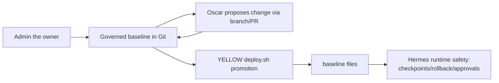

# Runtime classification (ADAL/CDEL/ESAL/PCL)

Public-safe source-preserving extraction.

## Classification framework

# Governance Levels Reference — ADAL/CDEL/ESAL/PCL

## Purpose

This document is the **canonical quick reference** for governance levels used by governed agent / Hermes-compatible runtime:

- **ADAL**
- **CDEL**
- **ESAL**
- **PCL**

Use this file for concise definitions and level tables. Detailed operational policy remains in:

- `docs/security/agent-pam-iam-adal-cdel-policy.md`
- `docs/security/external-access-register.md`

---

## Canonical definitions

- **ADAL** = **Agent Delegated Administration Level**: host/server/OS/service authority.
- **CDEL** = **Container Delegated Execution Level**: container/sandbox/Docker execution authority.
- **ESAL** = **External Service Access Level**: external service/API/SaaS/communication authority.
- **PCL** = **Project Confidentiality Level**: confidentiality and disclosure boundary.

## Authority roles (generic governance terms)

- **Governance Authority**: the human authority that approves governance-impacting decisions.
- **Authorized Operator**: human explicitly delegated by the Governance Authority for specific approvals/actions.
- **Runtime Owner**: owner accountable for runtime custody, recovery, and break-glass paths.
- **Project Owner**: owner accountable for project scope, confidentiality class, and release decisions.
- **Executor Agent**: the agent that proposes and executes within approved authority bounds.

---

## ADAL levels

| Level | Name | Meaning | Default policy |
|---|---|---|---|
| ADAL-0 | No access | No approved host/service operational access | Allowed |
| ADAL-1 | User access only | Dedicated user operations without sudo/elevation | Preferred default for many remote operations |
| ADAL-2 | Constrained delegated administration | Limited privileged operations with lockout/capture boundaries | Preferred upper bound for many important hosts |
| ADAL-2.5 / ADAL-2+ | Extended delegated operations / extended non-lockout administration | Broader resident-host operations (package install, diagnostics, service/runtime/container operations) while preserving no-lockout/no-capture constraints | Preferred resident-host target when explicitly approved |
| ADAL-3 | Full sudo with approval | Broad sudo operations gated by explicit approval for risky actions | Exceptional |
| ADAL-R3 | Resident broad sudo reality class | Runtime reality class where resident host authority is broader than policy target (for example broad NOPASSWD) | High-risk exception; document and review |
| ADAL-4 | Full sudo autonomous | Broad autonomous admin operations | Avoid for production governance |
| ADAL-5 | Agent-owned OS | Agent is sole OS admin while human may retain infrastructure recovery | Special-purpose only |
| ADAL-6 | Unbounded agent control | Agent controls OS and recovery path without human break-glass | Forbidden |

## ADAL contextual interpretation by target role

ADAL is contextual and must be interpreted against the target role:

- **Resident runtime host**: ADAL-2.5 may include controlled resident-runtime maintenance when explicitly documented and approved, including Hermes update preflight, version/status/log inspection, backups, reviewed Yellow `SKILL.md` proposal apply, user-service checks, and approved update planning.
- **External targets**: ADAL-2.5 remains narrower by default (read-only diagnostics and wrapper-mediated baseline audit). No arbitrary install/update/restart, no broad sudo, and no service/container state change without explicit approval/elevation.

`hermes update` is runtime-changing and requires explicit approval after preflight. If update execution requires maintenance beyond the approved resident ADAL-2.5 envelope (for example system-level package remediation, sudoers changes, or service-impacting recovery outside approved user-space operations), use ADAL-3T temporary elevation controls.

---

## CDEL levels

| Level | Name | Meaning | Default policy |
|---|---|---|---|
| CDEL-0 | No container access | No container backend use | Allowed |
| CDEL-1 | Ephemeral isolated container | Non-persistent isolated container without sensitive mounts | Preferred safe default |
| CDEL-2 | Persistent workspace container | Persistent sandbox workspace with bounded mounts | Acceptable with controls |
| CDEL-3 | Project-mounted container | Container with project/host mounts requiring stronger discipline | Requires explicit scope |
| CDEL-4 | Secret-forwarded container | Scoped secrets forwarded into container runtime | Requires explicit approval and guardrails |
| CDEL-5 | Host-privileged container | Privileged container / docker socket / host-level mounts | Forbidden by default |

---

## ESAL levels

| Level | Name | Meaning | Default policy |
|---|---|---|---|
| ESAL-0 | No external access | No external service/API/message authority | Allowed |
| ESAL-1 | Read-only lookup | Read-only external retrieval | Preferred low-risk baseline |
| ESAL-2 | Scoped write | Limited external write in approved scope | Requires explicit scope |
| ESAL-3 | Operational write | Operational messaging/repo/service actions in approved channels | Requires register + approval boundaries |
| ESAL-4 | Broad external operations | Broad external service operations with elevated risk | Exceptional |
| ESAL-5 | High-impact external authority | High-impact account/service authority (repo/admin, comms, account controls) | Strict governance + recovery custody |

---

## PCL levels

| Level | Name | Meaning | Disclosure policy |
|---|---|---|---|
| PCL-0 | Public | Public/shareable by design | External disclosure allowed |
| PCL-1 | Internal | Team/internal operational sharing | Limited external disclosure by approval |
| PCL-2 | Private | Private project/workstream material | Default: no external disclosure without approval |
| PCL-3 | Confidential | Sensitive governance/runtime/security context | Strict need-to-know; external disclosure requires explicit approval |
| PCL-4 | Restricted | Highly sensitive material with elevated custody controls | Strongest disclosure restrictions |

---

## Default rules

- Unknown authority = **no operational authority**.
- Unknown confidentiality = **PCL-2 Private**.
- Proposal does not equal permission.
- Capability does not equal authority.
- ADAL/CDEL/ESAL/PCL are governance concepts, not standalone skills.

## External Packages Management (concept)

External Packages Management is the human-managed target-specific package layer for external systems.

It may include:
- target manifests
- wrapper scripts
- sudoers templates
- install/rollback scripts
- audit wrapper definitions
- operational constraints
- elevation procedures
- post-action reporting expectations

Governance rules:
- External Packages are implementation boundaries, not permission by themselves.
- Wrapper existence does not equal permission.
- Capability does not equal authority.
- Proposal does not equal permission.

## ADAL-3T temporary elevation class

- **ADAL-3T** = temporary elevated delegated maintenance authority.
- ADAL-3T is task-scoped, time-limited, explicitly approved, logged, and revoked after expiry.
- ADAL-3T is not standing authority.
- A generic procedure name such as `hermes-sudoer-1T` may be used to denote an approximately one-hour temporary elevation envelope.
- Exact implementation is target/package-specific and human-admin managed.

ADAL-3T approval bundle must include:
- Governance Authority or explicitly delegated Authorized Operator approval
- start/end time
- purpose
- allowed command envelope
- backup/checkpoint where relevant
- rollback path
- post-action report
- revocation verification

---

---

## Register mapping

- **External Access Register** covers ADAL/CDEL/ESAL access targets:
 - `docs/security/external-access-register.md`
- **Project Register** covers PCL and project/workstream identity:
 - `config/project-register.yaml`
- **Profile Register** covers work-context/competence mapping:
 - `config/profile-register.yaml`
- **Skill Register** covers skill inventory/lifecycle only:
 - `config/skill-register.yaml`

# Operating model

## Roles

- **Human owner/admin (the owner)**: defines intent, approves sensitive actions, and accepts governance changes.
- **Oscar GitHub identity**: executes repository work (branching, patching, testing, PR drafting) within defined boundaries.
- **Hermes runtime**: runs operational behavior in `<runtime-register-root>` using governed inputs promoted from this repo.

## Baseline flow

Hermes runtime safety remains primary. Git remains curated baseline history only.

## Review-before-promotion

All durable governance changes are prepared in git, reviewed, and promoted intentionally. Runtime state does not override governance source.

## Fork/branch/PR workflow

1. Create a branch (or fork branch) for a scoped change.
2. Apply minimal patches with traceable commit history.
3. Run relevant checks.
4. Open a PR with summary, risks, and follow-ups.
5. Merge only after human review and policy compliance.

## Weekly autonomous maintenance branch policy

For guarded weekly maintenance automation:

- branch naming convention: `maintenance/hermes-weekly-YYYYMMDD-HHMM` (UTC timestamp);
- push target: Oscar fork remote (`origin` by default);
- upstream base: `upstream/main`;
- PR target: `<org>/<private-governance-repo>:main`;
- automation may open/update PR only; merge is always human-controlled.

## Runtime-first onboarding discipline

- External services and skill dependencies are onboarded in runtime first, then synchronized to repo documentation.
- Current runtime onboarding artifacts:
 - `docs/security/external-services-onboarding.md`
 - `docs/security/skill-external-dependency-register.md`
- Canonical sources remain:
 - `docs/security/external-access-register.md` for external services
 - `config/skill-register.yaml` and `docs/skills/skill-register.md` for skill entries
- GitHub role separation is mandatory in runtime guards:
 - Hermes public upstream (`<runtime-register-root>` origin) for core update checks,
 - Oscar fork for autonomous branch/push/PR work,
 - Eurobotics upstream as protected upstream repository and PR target.

## Weekly runtime scheduling model

- Weekly Hermes maintenance is scheduled with **user systemd** units, not Hermes cron.
- Rationale: Hermes should not self-manage its own runtime update/restart path from inside Hermes cron/session.
- Runtime units (deployed under `~/.config/systemd/user/`):
 - `agent-hermes-weekly-maintenance.service`
 - `agent-hermes-weekly-maintenance.timer`
- Scheduled command is guarded auto-update mode:
 - `ExecStart=/usr/local/bin/agent-hermes-weekly-maintenance --auto-update`
- Wrapper supports explicit modes:
 - `--check-only`
 - `--dry-run --auto-update`
 - `--auto-update`
- Guarded Git maintenance remains explicit/opt-in.

## Unknown/default handling

Unknown required level defaults to defer/block. Unknown confidentiality defaults to private handling. Unknown authority never implies permission.

## Action type to authority mapping

Map runtime actions to ADAL/CDEL, external operations to ESAL, and disclosure to PCL. Require all applicable dimensions.

## Operational trust versus authority proof

Operational familiarity is not authority proof. Require current register evidence and explicit delegated scope.

## Classification examples

Example: runtime update without checkpoint => defer.

Example: approved external read action => allow with telemetry.

Example: persistent automation change without approval => block.
